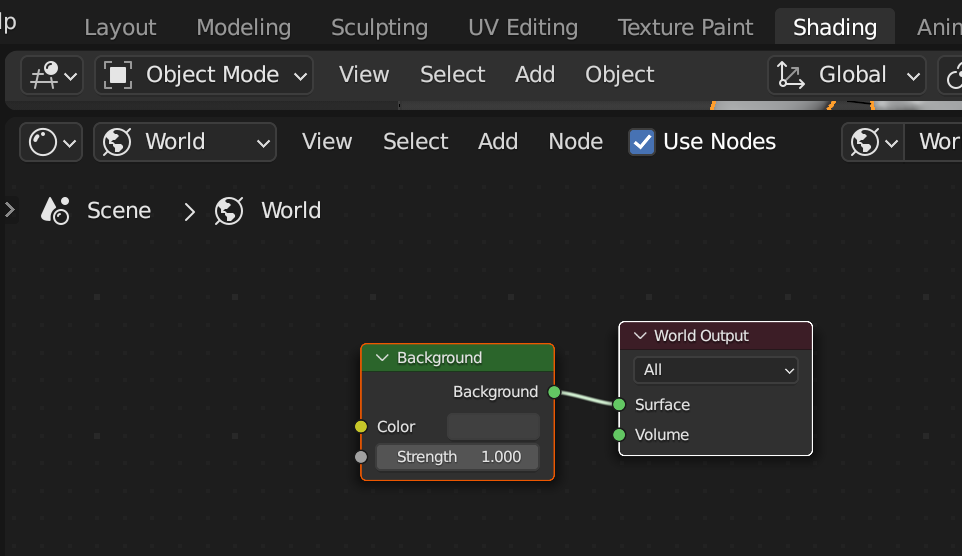
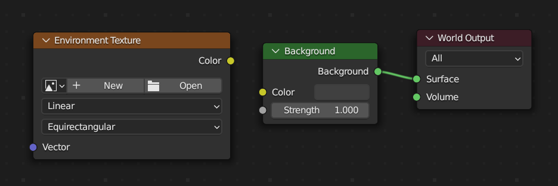
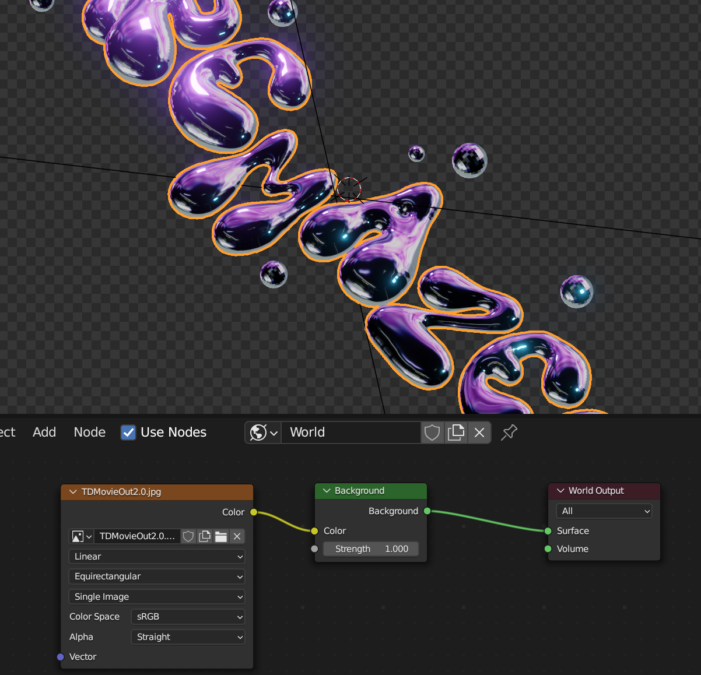
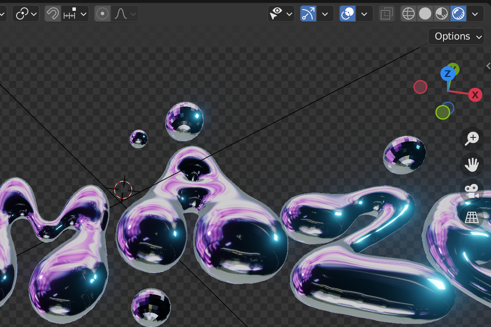
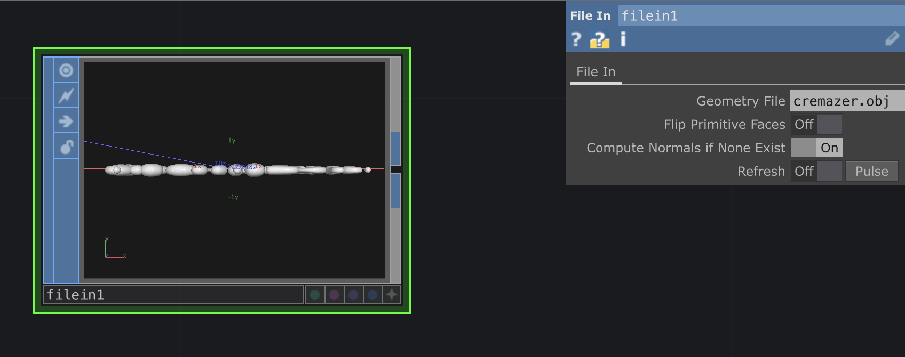
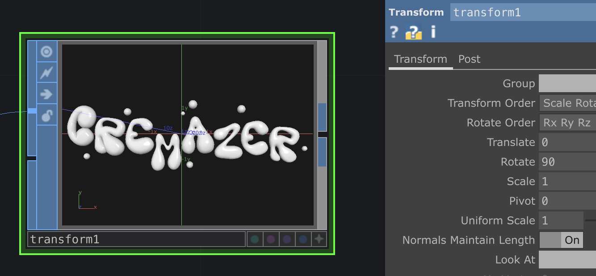
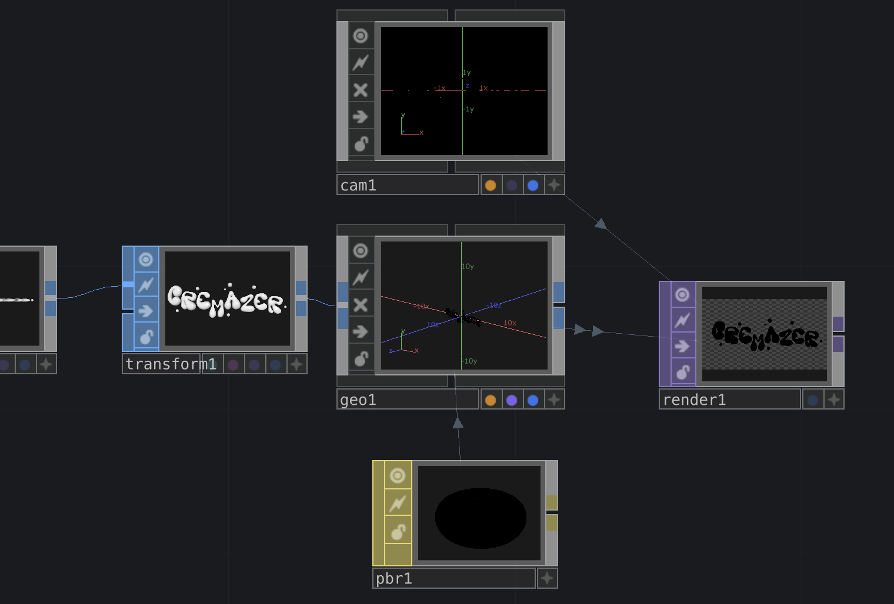
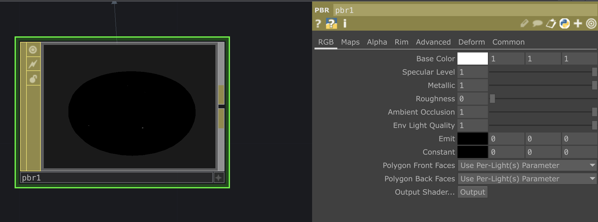
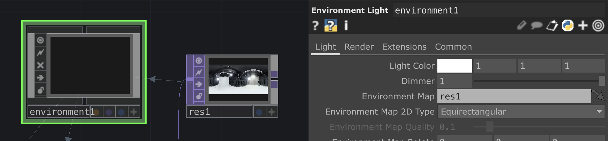
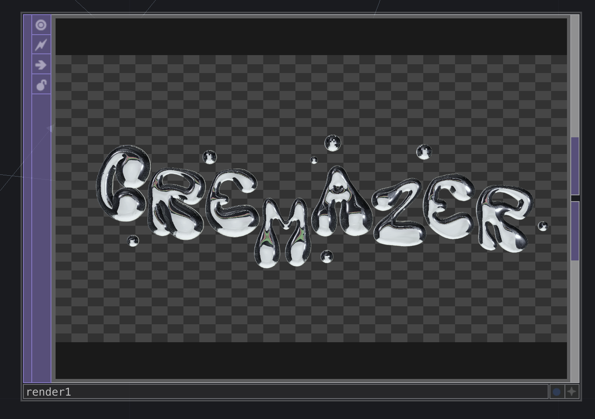

# Liquid Metal Aesthetic

## Blender

### Passer d'un dessin à une forme 3D simple

*Le dessin de base et le final dans Blender*

Tout d'abord, vectoriser le dessin et l'exporter en .svg .

Importer le .svg dans Blender en faisant `File` > `Import` > `Scalable Vector Graphics (.svg)`.

Sélectionner l'objet créé, appuyer sur "J" et agrandir la forme en bougeant la souris.

Placer l'objet à l'origine de la scène en faisant `click droit` > `Set Origin` > `Geometry to Origin`.

Dans le menu "Data" à droite de l'écran, scroller jusqu'à la partie "Geometry" et faire un Extrude en mettant un petit chiffre dans le paramètre `Extrude`.

Créer un mesh à partir de la forme en faisant `click droit` > `Convert To` > `Mesh`.

Dans le menu "Modifier" à droite de l'écran, cliquer sur `Add Modifier` et choisir `Remesh`.

Dans la partie `Voxel`, il doit y avoir "0.1 m" comme taille de Voxel par défaut, il faut réduire ce chiffre jusqu'à voir ré-apparaître la forme.

Il faut réduire ce chiffre jusqu'à voir ré-apparaître la forme.

Continuer à réduire la taille de Voxel jusqu'à ce que la forme soit plus ou moins lisse.

Cliquer sur la flèche vers le bas et faire `Apply`.

À nouveau dans le menu "Modifier", choisir `Smooth`.

Si besoin, aller dans le mode `Sculpt` et lisser encore plus par endroit avec l'outil "Smooth".

### Créer le material chrome

Aller dans le menu "Material" et supprimer le material par défaut "SVGMat".

Créer un nouveau material.

Mettre le paramètre "Metallic" au max et baisser le paramètre "Roughness".

En haut à droite, cliquer sur la troisième sphère pour activer le Viewport Shading et voir le material chrome avec l'Environnement Texture par défaut.

Pour changer l'Environnement Texture par défaut, aller dans l'onglet "Shading", puis dans Scene > World.

Il y a une node Background et une node World Output.

Faire Add > Environment Texture pour créer la node de l'Environnement Texture.

Cliquer sur Open pour ajouter la texture choisie.

Activer la dernière sphère en haut à droite pour voir le rendu du Material avec le background.

## TouchDesigner

Exporter la forme créée dans Blender en .obj.

Créer un `File In` SOP et importer l'obj.

Avec un `Transform` SOP, remettre l'obj dans le bon sens.

Créer un `Geo` COMP, une `Camera` COMP, un `Render` TOP et un `PBR` MAT.

Dans le `PBR` MAT, mettre "Metallic" à 1 et "Roughness" à 0.

Créer un `Environment Light` COMP et mettre l'environnement texture de notre choix dans "Environment Map". Si l'environnement texture est une image en mouvement, le nombre de FPS va crasher.

