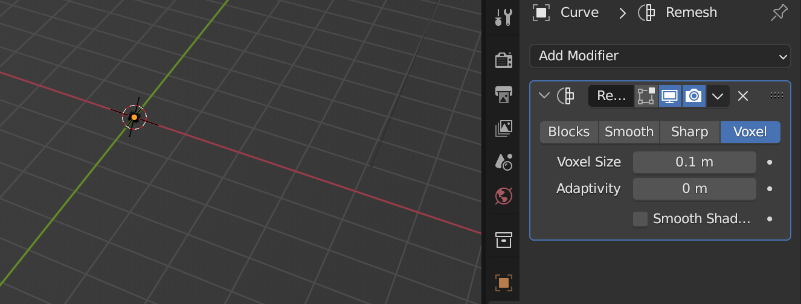

# Blender_To_Spark_FR

## Blender : passer d'un dessin à une forme 3D simple

*Le dessin de base et le final dans Blender*

Tout d'abord, vectoriser le dessin et l'exporter en .svg .

Importer le .svg dans Blender en faisant `File` > `Import` > `Scalable Vector Graphics (.svg)`.

Sélectionner l'objet créé, appuyer sur "J" et agrandir la forme en bougeant la souris.

Placer l'objet à l'origine de la scène en faisant `click droit` > `Set Origin` > `Geometry to Origin`.

Dans le menu "Data" à droite de l'écran, scroller jusqu'à la partie "Geometry" et faire un Extrude en mettant un petit chiffre dans le paramètre `Extrude`.

Créer un mesh à partir de la forme en faisant `click droit` > `Convert To` > `Mesh`.

Dans le menu "Modifier" à droite de l'écran, cliquer sur `Add Modifier` et choisir `Remesh`.

Dans la partie `Voxel`, il doit y avoir "0.1 m" comme taille de Voxel par défaut, il faut réduire ce chiffre jusqu'à voir ré-apparaître la forme.

Il faut réduire ce chiffre jusqu'à voir ré-apparaître la forme.

Continuer à réduire la taille de Voxel jusqu'à ce que la forme soit plus ou moins lisse.

Cliquer sur la flèche vers le bas et faire `Apply`.

À nouveau dans le menu "Modifier", choisir `Smooth`.

## Spark

